- [1. Lý thuyết](#1-L%C3%BD-thuy%E1%BA%BFt)
  - [1.1. Kiến trúc tổng quan Linux](#11-Ki%E1%BA%BFn-tr%C3%BAc-t%E1%BB%95ng-quan-Linux)
    - [1.1.1. Kiến trúc](#111-Ki%E1%BA%BFn-tr%C3%BAc)
    - [1.1.2. Cách thức tổ chức:](#112-C%C3%A1ch-th%E1%BB%A9c-t%E1%BB%95-ch%E1%BB%A9c)
  - [1.2. `awk`](#12-awk)
  - [1.3. `grep`](#13-grep)
  - [1.4. `xargs`](#14-xargs)
  - [1.5. `netstat`](#15-netstat)
  - [1.6. `find`](#16-find)
  - [1.7. Regular expression](#17-Regular-expression)
  - [1.8. Shell scripting](#18-Shell-scripting)
    - [1.8.1. Biến trong Shell](#181-Bi%E1%BA%BFn-trong-Shell)
    - [1.8.2. Mảng](#182-M%E1%BA%A3ng)
    - [1.8.3. Cấu trúc rẽ nhánh](#183-C%E1%BA%A5u-tr%C3%BAc-r%E1%BA%BD-nh%C3%A1nh)
    - [1.8.4. Cấu trúc lặp](#184-C%E1%BA%A5u-tr%C3%BAc-l%E1%BA%B7p)
    - [1.8.5. Hàm](#185-H%C3%A0m)
- [2. Bài tập](#2-B%C3%A0i-t%E1%BA%ADp)
  - [2.1. Processing texts](#21-Processing-texts)
    - [2.1.1. Count number of specifying a specific pattern in a log file](#211-Count-number-of-specifying-a-specific-pattern-in-a-log-file)
    - [2.1.2. Calculate KLOC of code C/C++ files in a directory](#212-Calculate-KLOC-of-code-CC-files-in-a-directory)
  - [2.2. System](#22-System)
    - [2.2.1. Kill multiple processes following a patterns (using awk, grep, xargs)](#221-Kill-multiple-processes-following-a-patterns-using-awk-grep-xargs)
    - [2.2.2. Kill processes opening a specific port (using netstat, grep...)](#222-Kill-processes-opening-a-specific-port-using-netstat-grep)
    - [2.2.3. List opennned ports, handles](#223-List-opennned-ports-handles)
    - [2.2.4. Find files via regular expressions, and remove them](#224-Find-files-via-regular-expressions-and-remove-them)
    - [2.2.5. List, one at a time, all files larger than 100K in the /home/username directory tree. Give the user the option to delete or compress the file, then proceed to show the next one. Write to a logfile the names of all deleted files and the deletion times.](#225-List-one-at-a-time-all-files-larger-than-100K-in-the-homeusername-directory-tree-Give-the-user-the-option-to-delete-or-compress-the-file-then-proceed-to-show-the-next-one-Write-to-a-logfile-the-names-of-all-deleted-files-and-the-deletion-times)
  - [2.3. Shell Scripting](#23-Shell-Scripting)
    - [2.3.1. Give you a text file which contains several numbers (may be serveral thousand), each on it's own line. You task is write a script which print the sum of all numbers in the file. I'm looking for effficient solution.](#231-Give-you-a-text-file-which-contains-several-numbers-may-be-serveral-thousand-each-on-its-own-line-You-task-is-write-a-script-which-print-the-sum-of-all-numbers-in-the-file-Im-looking-for-effficient-solution)
- [3. Link tham khảo](#3-Link-tham-kh%E1%BA%A3o)


# 1. Lý thuyết

## 1.1. Kiến trúc tổng quan Linux

### 1.1.1. Kiến trúc

-   Các hệ điều hành được xây dựng trên Linux Kernel được gọi là các distro của Linux. Cấu trúc đó chia làm 3 phần chính:

    

-   Kernel là trái tim của hệ điều hành, chứa các modules hay các thư viện để quản lý giao tiếp giữa phần cứng và ứng dụng
-   Nằm phía trên Kernel chính là Shell. Đây là chương trình có chức năng thực thi các command từ người dùng hoặc từ các apps, chuyển đến Kernel xử lý. Nó là trung gian giữa Kernel và Application, phiên dịch các lệnh từ Application chuyển tới Kernel thực thi:
    -   sh (the Bourne Shell): shell nguyên thủy của UNIX 
    -   bash (Bourne-again shell): shell mặc định trên Linux
    -   csh (C shell): viết bằng C
    -   ash (Almquist shell), tsh (TENEX C shell), zsh (Z shell)
-   Application: các ứng dụng, phần mềm, tiện ích
-   Các thuật ngữ khác:
    -   X-window: giao diện người dùng của Linux, đưa ra các hàm, các lệnh điều khiển màn hình và chuột giúp user có GUI. X-window không phải là Desktop-Environment như GNOME, KDE,..
    -   Desktop-Environment: môi trường đồ họa bạn sử dụng, là cầu nối giữa nguời dùng và X-window system

### 1.1.2. Cách thức tổ chức:
-   "Every thing in UNIX is file"
-   Linux tổ chức theo cách riêng khác hẳn Windows, không phân ổ đĩa, mọi thứ điều là file
    
-   Các file trong linux được bắt đầu bằng / ( root - thư mục gốc ) và sau đó tới các thư mục cấp nhỏ hơn. Các thư mục chính sau root sẽ là: 
    -   /etc: chứa các file cấu hình hệ thống
    -   /home: các thư mục của mỗi user trong này (không có ROOT User)
    -   /usr: chứa các docs, game, tập tin đồ họa, thư viện, lệnh và files của user, admin
    -   /bin: các lệnh thông thường của Linux   ls, date, chmod, ...
    -   /sbin: các lệnh của admin và các daemon (chương trình máy tính chạy dưới nền, không phải dưới sự kiểm soát của người dùng tương tác)
    -   /root: thư mục gốc của ROOT User
    -   /boot: các thông tin về khởi động
    -   /mnt: chứa các thiết bị ngoại vi cd rom, đĩa mềm, hệ thống file (FAT32, NTFS)
    -   /dev: chứa các files thể hiện các điểm truy cập tới các thiết bị trong hệ thống như terminal device (tty), đĩa mềm (fd), đĩa cứng (hd), RAM (ram)
    -   /tmp: các file tạm cho quá trình sử dụng
    -   /opt: được dùng để cài "optional software", giữ các sản phẩm phần mềm thương mại
    -   /proc: đây lưu trữ hệ thống file ảo bởi Linux Kernel, đại diện cho các tiến trình. Các file này có thể đọc được và cho ta một cách nhìn của kernel đối với computer
    -   /var: chứa các file data có khả năng thay đổi thời gian thực
    -   /var/log: chứa các file lưu lại các activities của hệ thống, liên tục ghi lại hoạt động và thay đổi theo thời gian thực

## 1.2. `awk`
-   Awk tương tự một ngôn ngữ lập trình hỗ trợ thao tác dễ dàng đối với kiểu dữ liệu có cấu trúc và tạo ra những kết quả được định dạng. Nó được đặt tên bằng cách viết tắt các chữ cái đầu tiên của các tác giả: Aho, Weinberger và Kernighan
-   Awk thường được sử dụng cho việc tìm kiếm và xử lý text. Nó sẽ tìm kiếm một hoặc nhiều file để xem xem trong các file đó có dòng nào bao gồm những `pattern` (khuôn mẫu) cho trước hay không, sau đó thực hiện những `action` (hành động) tương ứng
-   Một số đặc điểm nổi bật của Awk:
    -   nó xem 1 file text giống như bảng dữ liệu, bao gồm các bản ghi và các trường
    -   tương tự những ngôn ngữ lập trình phổ biến, Awk cũng có những khái niệm như biến, điều kiện, vòng lặp
    -   awk có những toán tử số học và toán tử thao tác chuỗi
-   Câu lệnh được viết với Awk sẽ nhận đầu vào là một file hoặc một input có dạng chuẩn, rồi tạo ra output theo chuẩn của nó. Awk chỉ làm việc với các file text
    
    ```bash
    awk '/search pattern 1/ {Actions}
         /search pattern 2/ {Actions}' file
    ```
-   Ví dụ:
  
    ```bash
    ➜  ~ cat employee.txt 
    100  Thomas  Manager    Sales       $5,000
    200  Jason   Developer  Technology  $5,500
    300  Sanjay  Sysadmin   Technology  $7,000
    400  Nisha   Manager    Marketing   $9,500
    500  Randy   DBA        Technology  $6,000
    ```

-   Hành động mặc định: print tất cả các dòng

    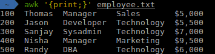

-   In ra dòng chứa xâu mẫu
  
    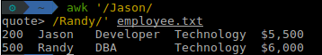

-   In trường nhất định

    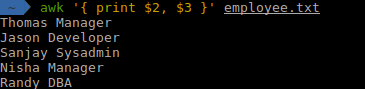

-   Hành động khởi tạo và kết thúc

    ```bash
    BEGIN {Actions}
    {Action} # Action for every line in a file
    END {Actions}
    ```

- Phép so sánh

    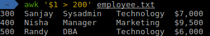

-   Điều kiện và tính toán số học

    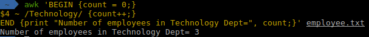

## 1.3. `grep`

-   `grep` là command hiển thị line chứa chuỗi kí tự trong file. Có thể chỉ định nhiều file hoặc nhiều đường dẫn của đối tượng search. Có thể thay file hoặc đường dẫn bằng kết quả output từ command khác. Đây là trường hợp hay được sử dụng khi dùng với grep 
-   Các option liên quan pattern search
    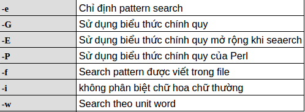
-   Các option liên quan hiển thị
    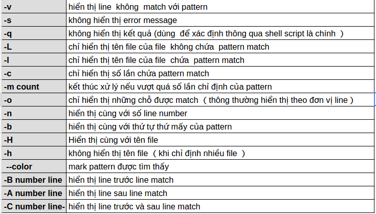

-   Ví dụ:
  
    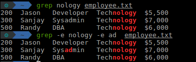


## 1.4. `xargs`

-   Chúng ta thường sử dụng ống dẫn (pipe) để chuyển hướng stdout của 1 lệnh đến stdin của một lệnh khác    
-   Ví dụ: 

    ```bash
    $ cat foo.txt | grep "test
    ```

-   Tuy nhiên, một vài lệnh chỉ chấp nhận các đối số của lệnh mà không chấp nhận 1 dòng dữ liệu
-   `xargs` là 1 lệnh rất hữu dụng trong việc xử lý chuyển đổi dữ liệu từ stdin sang đối số dòng lệnh. Nó có thể thao tác stdin và chuyển đối nó thành các đối số dòng lệnh cho 1 lệnh được chỉ rõ
-   Chuyển đổi nhiều dòng thành 1 dòng
    
    ```bash
    $ cat example.txt
    1 2 3 4 5 6
    7 8 9 10
    11 12
    ```
    ```bash
    $ cat example.txt | xargs
    1 2 3 4 5 6 7 8 9 10 11 12
    ```
-   Chuyển đổi 1 dòng thành nhiều dòng

    ```bash
    $ echo "splitXsplitXsplitXsplit" | xargs -d X -n 2
    split split
    split split
    ```
-   `-n 2` là 2 đối số trên một dòng, `-d X` bỏ đi kí tự X 

## 1.5. `netstat` 
-   Lệnh netstat trên linux là một lệnh nằm trong số các tập lệnh để giám sát hệ thống trên linux. 
-   netstat giám sát cả chiều in và chiều out kết nối vào server, hoặc các tuyến đường route, trạng thái của card mạng. 
-   Lệnh netstat rất hữu dụng trong việc giải quyết các vấn đề về sự cố liên quan đến network như là lượng connect kết nối, traffic, tốc độ, trạng thái của từng port, Ip …

## 1.6. `find`

-   Tìm theo tên:
  
    ```bash
    find -name "file-name"
    ```

-   Tìm theo thể loại:
  
    ```bash
    find -type f -name "*.txt"
    ```
    ```
    f: regular file
    d: directory (thư mục)
    l: symbolic link
    c: character devices
    b: block devices
    ```

-   Tìm theo size: tất cả những file nặng đúng 50 bytes, +50c tức trên 50 bytes, -50c tức dưới 50 bytes
  
    ```bash
    find / -size 50c
    ```

    ```
    c: bytes
    k: Kilobytes
    M: Megabytes
    G: Gigabytes
    b: 512-byte blocks
    ```

-   Tìm theo thời gian
    -   Access time: -atime (lần cuối truy cập đọc/ghi)
    -   Modification time: -mtime (lần cuối nội dung file được chỉnh sửa)
    -   Change time: -ctime (lần cuối inode meta-date được sửa)   
    -   Để tìm các file được chỉnh sửa trong vòng 1 ngày trước:

        ```bash
        find / -mtime 1
        ```
-   Tìm theo Owner và Permission: chúng ta có thể tìm theo Owner với -user, -group hay theo Permission với -perm

-   Kết hợp find với lệnh khác:
    
    ```bash
    find find_parameters -exec command_and_params {} \;
    ```
-   Tìm các file có permission là 744 và chmod sang 755:

    ```bash
    find / -type f -perm 777 -print -exec chmod 755 {} \;
    ```

-   Tìm 1 file test.py và xóa nó:

    ```bash
    find . -type f -name "test.py" -exec rm -f {} \;
    ```

-   Hoặc xóa các file có đuôi .mp3 ở dir hiện tại:

    ```bash
    find . -type f -name "*.mp3" -exec rm -f {} \;
    ```

## 1.7. Regular expression
-   Chúng ta có thể test Regex tại trang https://regex101.com/
-   `[xyz]` Tìm và so sánh tất cả ký tự nằm trong dấu ngoặc vuông và trùng khớp với 1 ký tự trong dấu ngoặc vuông. Ví dụ: `[31]` sẽ trùng khớp với 3 hoặc 1, `[0123456789]` sẽ trùng khớp với bất kỳ một ký tự nào trong khoảng từ 0 đến 9
-   `[^xyz]` So sánh và không trùng khớp với những ký tự nằm trong khoảng chỉ định. Dấu ^ (dấu mũ) nằm trong dấu ngoặc vuông là một dấu phủ định. Ví dụ: `[^a-z]` sẽ không trùng khớp với tất cả các ký tự nằm trong khoảng từ a đến z
-   `^` Trùng khớp với phần đầu của chuỗi đích. Ví dụ: `^a` sẽ trùng khớp với chữ a trong chuỗi abc, `^\w+` sẽ trùng khớp với chữ đầu tiên – chữ "the" của chuỗi **"The quick brown fox jumps over the lazy dog".**
-   `$` Trùng khớp với phần cuối của chuỗi đích. Ví dụ: `c$` sẽ trùng khớp với chữ c trong chuỗi abc, `\w+$` sẽ trùng khớp với chữ cuối – chữ "dog" của chuỗi **"The quick brown fox jumps over the lazy dog".**
-   `+` Trùng khớp với 1 hoặc nhiều lần ký tự đứng trước nó. Ví dụ `\d+` sẽ chỉ trùng với chuỗi có từ 1 con số trở lên
-   `*` Trùng khớp với 0 hoặc nhiều lần ký tự đứng trước nó. Ví dụ `\d*` sẽ trùng với chuỗi có chứa 1 chữ số hoặc k có chữ số nào cũng đc
-   `?` Trùng khớp với 0 hoặc 1 lần ký tự đứng trước nó
-   `.` Trùng khớp với 1 ký tự đơn bất kỳ ngoại trừ ký tự ngắt dòng (line-break) và cũng không lấy được ký tự có dấu (unicode). Ví dụ: `.` sẽ trùng khớp với ký tự `a` hoặc `b` hoặc `c` trong chuỗi `abc`. Nhưng `.` sẽ không bắt được các chữ `ă` hoặc `ê`
-   `x{n}` Trùng khớp đúng với n lần ký tự đứng trước nó. n là một số không âm. Ví dụ `\d{2}` sẽ bắt đc các số có 2 chữ số đứng liền nhau
-   `x{n,m}` Trùng khớp với ít nhất n lần và nhiều nhất là m lần ký tự đứng trước nó. n và m là một số không âm và n <= m. Ví dụ: `a{1,3}` sẽ khớp với hah, haah, haaah nhưng không khớp với haaaah
-   `x|y` Trùng khớp với x hoặc y. Ví dụ: `slow|fast` sẽ khớp với chữ slow hoặc fast trong chuỗi đích
-   `\b` Trùng khớp với toàn bộ ký tự đứng trước nó. Ví dụ: `hello\b` sẽ trùng khớp với toàn bộ từ hello trong chuỗi **hello world** nhưng sẽ không khớp với chuỗi **helloworld**
-   `\d` Trùng khớp 1 ký tự số (digit)
-   `\D` Trùng khớp 1ký tự không phải số (non-digit)
-   `\s` Trùng khớp 1 ký tự khoảng trắng (whitespace) bao gồm khoảng trắng tạo ra bởi phím Tab
-   `\S` Trùng khớp với 1 ký tự không phải là khoảng trắng (non-whitespace)
-   `\w` Trùng khớp với các ký tự là từ (word) bao gồm dấu `_`(underscore) và chữ số

-   `\W` Trùng khớp với các ký tự không phải là từ (non-word). Ví dụ: `\W` sẽ khớp với ký tự % trong chuỗi "100%"
-   `\uxxxx` Trùng khớp với 1 ký tự unicode. Ví dụ: `\u00FA` sẽ khớp với ký tự "ú", `\u00F9` sẽ khớp với ký tự "ù"
-   `\pL` Trùng khớp với một ký tự Unicode bất kỳ ngoại trừ dấu cách. Đây chính là cú pháp viết hoàn hảo hơn của dấu `.`. Ví dụ `\pL+` sẽ lấy được chuỗi `truyền`, `thuyết` trong chuỗi "truyền thuyết"

## 1.8. Shell scripting

-   Về cơ bản shell script là 1 tập hợp các lệnh được thực thi nối tiếp nhau, bắt đầu 1 shell script thường có ghi chú comment mở đầu bằng `#`

    ```bash
    #!/bin/bash

    HELLO="Xin chào, "
    HELLO=$(printf "%s %s" "$HELLO" "$(whoami)" "!")
    DAY="Hôm nay là ngày "
    DAY=$(printf "%s %s" "$DAY" "$(date)")
    echo $HELLO
    echo $DAY
    ```
    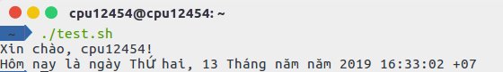


-   Trước khi làm bất cứ điều gì với script, cần thông báo với system rằng chuẩn bị có shell chạy bằng dòng lệnh `#!/bin/bash`
-   Để soạn thảo shell script thì có thể gõ ngay trên terminal hoặc dùng các trình soạn thảo nào mà bạn thích, vim, gedit, kate,... sau đó lưu lại file *.sh, ví dụ `test.sh`
-   Sau đó thiết lập quyền thực thi cho shell `$chmod +x test.sh`
-   Rồi chạy script bằng 1 trong 3 cách: `bash test.sh`, `sh test.sh`, `./test.sh`


### 1.8.1. Biến trong Shell
-   Khai báo
  
    ```bash
    CONG="Lê Thành Công"
    ```

-   Sử dụng
  
    ```bash
    CONG="Lê Thành Công"
    echo $CONG
    
    ```
-   Có thể set readonly: `readonly CONG`
-   Xóa giá trị của biến: `unset CONG`

### 1.8.2. Mảng

```bash
    #!/bin/sh

    NAME[0]="Zara"
    NAME[1]="Qadir"
    NAME[2]="Mahnaz"
    NAME[3]="Ayan"
    NAME[4]="Daisy"
    echo "First Index: ${NAME[0]}"
    echo "Second Index: ${NAME[1]}"
    echo "First Method: ${NAME[*]}"
    echo "Second Method: ${NAME[@]}"
```

-   Kết quả:
-   
```bash
$./test.sh
First Index: Zara
Second Index: Qadir
First Method: Zara Qadir Mahnaz Ayan Daisy
Second Method: Zara Qadir Mahnaz Ayan Daisy
```

### 1.8.3. Cấu trúc rẽ nhánh

```bash
#!/bin/sh

a=10
b=20

if [ $a == $b ]
then
   echo "a is equal to b"
fi

if [ $a == $b ]
then
   echo "a is equal to b"
elif [ $a -gt $b ]
then
   echo "a is greater than b"
elif [ $a -lt $b ]
then
   echo "a is less than b"
else
   echo "None of the condition met"
fi
```

### 1.8.4. Cấu trúc lặp

-   Vòng lặp while
  
```bash
#!/bin/sh

a=0

while [ $a -lt 10 ]
do
   echo $a
   a=`expr $a + 1`
done
```

-   Vòng lặp for
  
```bash
#!/bin/sh

for var in 0 1 2 3 4 5 6 7 8 9
do
   echo $var
done
```

-   Vòng lặp until
  
```bash
#!/bin/sh

a=0

until [ ! $a -lt 10 ]
do
   echo $a
   a=`expr $a + 1`
done
```

### 1.8.5. Hàm 

```bash
#!/bin/sh

# Define your function here
Hello () {
   echo "Hello World"
}

# Invoke your function
Hello

```

-   Dùng hàm có params:
  
```bash
#!/bin/sh

# Define your function here
Hello () {
   echo "Hello World $1 $2 $3"
}

# Invoke your function
Hello Lê Thành Công
```

-   Lấy kết quả trả về từ hàm
  
```bash
#!/bin/sh

# Define your function here
Hello () {
   echo "Hello World $1 $2 $3"   
   return 10
}

# Invoke your function
Hello Lê Thành Công

# Capture value returnd by last command
ret=$?

echo "Return value is $ret"
```

# 2. Bài tập

## 2.1. Processing texts

### 2.1.1. Count number of specifying a specific pattern in a log file

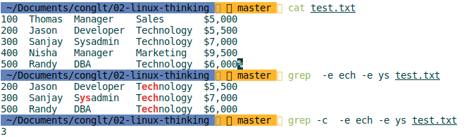
### 2.1.2. Calculate KLOC of code C/C++ files in a directory
```bash
find -type f \( -name "*.cpp" -o -name "*.c" -o -name "*.h" \) -exec awk 'BEGIN {count = 0;}
{count++;}  
END {print count/1000, "KLOC";}' {} +
```

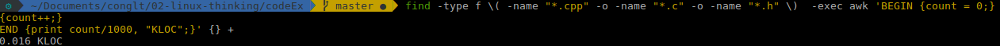

## 2.2. System

### 2.2.1. Kill multiple processes following a patterns (using awk, grep, xargs)
```bash
ps -A | grep gedit | awk '{print $1}' | xargs kill -9 $1
```
### 2.2.2. Kill processes opening a specific port (using netstat, grep...)

```bash
sudo kill -9 $(sudo lsof -i :80 | grep LISTEN | awk '{print $2}'| xargs -n1 )
```

```bash
sudo kill -9 $(sudo netstat -nlp | grep :80| awk '{print $7}'| sed 's/[^0-9]*//g'| xargs)
```

### 2.2.3. List opennned ports, handles
```bash
netstat -lntu
```
   ```
    -l = only services which are listening on some port
    -n = show port number, don't try to resolve the service name
    -t = tcp ports
    -u = udp ports
    -p = name of the program
   ```

### 2.2.4. Find files via regular expressions, and remove them

```bash
find -regex '.*copy.*' -exec  rm -rf {} \;
```

### 2.2.5. List, one at a time, all files larger than 100K in the /home/username directory tree. Give the user the option to delete or compress the file, then proceed to show the next one. Write to a logfile the names of all deleted files and the deletion times.

-  Đối với bài tập này, ta sử dụng các lệnh cơ bản trong Linux shell như cấu trúc lặp while .. do, lặp có chọn select .. in, điều kiện rẽ nhánh với case .. in. Bên cạnh đó là các command tìm kiếm với find, gzip để nén và rm để xóa kết hợp với lệnh find, lệnh tee để ghi ra log
  
-  [File script](exercise/deleteOrCompress/deleteOrCompress.sh)

## 2.3. Shell Scripting


### 2.3.1. Give you a text file which contains several numbers (may be serveral thousand), each on it's own line. You task is write a script which print the sum of all numbers in the file. I'm looking for effficient solution.

-  Giải pháp dùng awk:

   ```bash
   awk '{ sum += $1 } END { print sum }'
   ```
-  Giải pháp dùng C:
   
   ```C++
   ssize_t read;
   char *line = NULL;
   size_t len = 0;
   double sum = 0.0;

   while (read = getline(&line, &len, stdin) != -1) {
        sum += atof(line);
   }

   printf("Sum of number in file is: %.0f (unit)\n", sum);
   ```

# 3. Link tham khảo

https://www.thekalitools.com/2017/10/tim-hieu-ve-cau-truc-he-ieu-hanh-linux.html

https://viblo.asia/p/tim-hieu-awk-co-ban-gGJ59229KX2

http://www.justpassion.net/tech/programming/bash-shell/lam-quen-voi-xargs.html

https://viblo.asia/p/tim-hieu-ve-command-grep-EoDGQqPPGbV

https://nguyenhuuhoang.com/huong-dan-doc-hieu-lenh-netstat-tren-linux/

https://medium.com/@doanhtu/c%C3%A1ch-d%C3%B9ng-find-%C4%91%E1%BB%83-t%C3%ACm-file-tr%C3%AAn-linux-75fc4c745ae3

https://viblo.asia/p/hoc-regular-expression-va-cuoc-doi-ban-se-bot-kho-updated-v22-Az45bnoO5xY

https://viblo.asia/p/lam-quen-voi-shell-script-ZabG9zYzvzY6#_bien-trong-shell-4

https://www.unix.com/unix-for-advanced-and-expert-users/252175-help-shell-script-list-files-delete-them-log-them.html