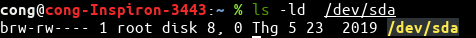
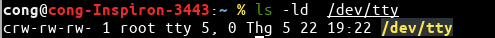

<!-- TOC -->
- [1. Lý thuyết](#1-l%C3%BD-thuy%E1%BA%BFt)
  - [1.1. File and File System in Linux](#11-file-and-file-system-in-linux)
    - [1.1.1. `File descriptor`](#111-file-descriptor)
    - [1.1.2. `Regular files` and `Special files`](#112-regular-files-and-special-files)
  - [1.2. Process](#12-process)
    - [1.2.1. Khái niệm](#121-kh%C3%A1i-ni%E1%BB%87m)
    - [1.2.2. `Memory Layout`](#122-memory-layout)
  - [1.3. Thread](#13-thread)
    - [1.3.1. Khái niệm Thread](#131-kh%C3%A1i-ni%E1%BB%87m-thread)
    - [1.3.2. POSIX Thread](#132-posix-thread)
    - [1.3.3. API trong POSIX](#133-api-trong-posix)
    - [1.3.4. Multi-Threading, các vấn đề gặp phải](#134-multi-threading-c%C3%A1c-v%E1%BA%A5n-%C4%91%E1%BB%81-g%E1%BA%B7p-ph%E1%BA%A3i)
    - [1.3.5. `Race condition` và `Deadlock`, cách ngăn chặn](#135-race-condition-v%C3%A0-deadlock-c%C3%A1ch-ng%C4%83n-ch%E1%BA%B7n)
  - [1.4. Synchronization](#14-synchronization)
    - [1.4.1. Khái niệm `Semaphore`, so sánh `Semaphore` với `Mutex`](#141-kh%C3%A1i-ni%E1%BB%87m-semaphore-so-s%C3%A1nh-semaphore-v%E1%BB%9Bi-mutex)
    - [1.4.2. `Reader writer problem`](#142-reader-writer-problem)
  - [1.5. Networking](#15-networking)
    - [1.5.1. Socket](#151-socket)
    - [1.5.2. TCP và UDP](#152-tcp-v%C3%A0-udp)
    - [1.5.3. Nonblocking I/O và Blocking I/O](#153-nonblocking-io-v%C3%A0-blocking-io)
      - [1.5.3.1. Blocking I/O](#1531-blocking-io)
      - [1.5.3.2. Non-blocking I/O](#1532-non-blocking-io)
- [2. Bài tập](#2-b%C3%A0i-t%E1%BA%ADp)
  - [2.1. Viết chương trình C mô phỏng ls -l](#21-vi%E1%BA%BFt-ch%C6%B0%C6%A1ng-tr%C3%ACnh-c-m%C3%B4-ph%E1%BB%8Fng-ls--l)
  - [2.2. Trò chơi xếp bi](#22-tr%C3%B2-ch%C6%A1i-x%E1%BA%BFp-bi)
- [3. Nguồn tham khảo](#3-ngu%E1%BB%93n-tham-kh%E1%BA%A3o)
  <!-- /TOC -->

# 1. Lý thuyết

## 1.1. File and File System in Linux

-   Triết lý của Linux: `everything-is-a-file`. Có nghĩa là mọi thứ trong hệ thống đều có thể được biểu diễn dưới dạng một file, từ file cổ điển .txt đến các đường dẫn (directory) hay các thiết bị như character device, socket.... Khi chúng ta sử dụng command "ls -la" để liệt kê các file trong đường dẫn hiện tại, ký tự đầu tiên của từng dòng chính là loại của file đó. Hệ điều hành Linux có các loại file sau đây:
  
    ```
    -   File thường (regular file)
    d 	Đường dẫn (directory)
    c 	Character device file
    b 	Block device file
    s 	Domain socket
    p 	pipe
    l 	symbolic link
    ```

-   Cấu trúc thư mục và tập tin trong Linux ta đã đề cập ở phần linux shell. Phần này sẽ tìm hiểu `file descriptor` trong kernel, phân biệt `regular files` và `special files`
  
### 1.1.1. `File descriptor`

-   Về phía người sử dụng, file chứa data và được phân biệt với nhau bằng file name.
-   Về phía hệ thống, file được phân biệt bằng chỉ số index node, viết tắt là inode. Mỗi file name có 1 inode đi kèm. Chỉ số inode tham chiếu đến 1 vùng nhớ trong đó có chứa địa chỉ vùng nhớ lưu trữ data.
-   Để đọc hoặc ghi vào một file, trước tiên file đó phải mở ra. Tất nhiên, mỗi file cần được định danh bởi một ID hay chính là một số nguyên dương duy nhất được gọi là `file descriptor` 
-   Các `syscall` khi thao tác với file này sẽ gọi bằng `file descriptor` làm tham số truyền xuống kernel   

    

    

-   Với mỗi process, kernel lưu và duy trì một bảng danh sách các `file descriptor` được gọi là `file table` và sử dụng bảng đó để tra cứu theo `file descriptor` và tìm đến đúng file và tiến trình mà tầng user muốn thao tác 

    

-   Cụ thể hơn về file descriptor:

    


    -   Khi ta mở hoặc tạo một file, kernel sẽ trả về giá trị file descriptor cho process tương ứng. Khi ta đóng file đó lại thì file descriptor này sẽ được giải phóng để cấp phát cho những lần mở file sau. Ví dụ. nếu người dùng A mở 10 tập tin để đọc thì sẽ có 10 FD tương ứng (có thể được đánh số lần lượt là 101, 102, 103,…, 110) và các giá trị này sẽ được lưu trong bảng danh sách chứa file descriptors

    -   Mỗi một process sẽ có một bảng danh sách file descriptor riêng do kernel quản lý, kernel sẽ chuyển danh sách này sang danh sách file table quản lý toàn bộ file được truy cập bởi tất cả các process. File table này sẽ lưu lại chế độ mà file đó đang được sử dụng (đọc, ghi, chèn). Và file table này sẽ được mapping qua một bảng thứ 3 là inode table thật sự quản lý các file nằm bên dưới. Khi một tiến trình muốn đọc hoặc ghi file, tiến trình này sẽ chuyển file descriptor cho kernel xử lý (bằng các lệnh system call) và kernel sẽ truy cập file này thay cho process. Process không thể truy cập trực tiếp các file hoặc inode table

### 1.1.2. `Regular files` and `Special files`

```
    -   File thường (regular file)
    d 	Đường dẫn (directory)
    c 	Character device file
    b 	Block device file
    s 	Domain socket
    p 	pipe
    l 	symbolic link
```

-   `Regular files` là các file data thông thường bao gồm text, data hay program instructions. Đó là các file thường gặp nhất trong Linux:
    -   Readable files
    -   Binary files
    -   Image files
    -   Compressed files,...
-   `Special files` là các file có thể được lưu trữ trong file system. Hay còn gọi là `device file`. Mục đích là nhằm chuyển đổi giao tiếp device như là một file trong file system. Khi data được đọc hay ghi thì thao tác thực hiện ngay lập tức, không phải tuân theo qui tắc file thông thường
-   Ngoài `regular file` thì còn lại là các `special files`

-   Special file thông dụng nhất là `directory`. Tất nhiên, directory là các thư mục chứa các file hoặc thư mục con, được đánh dấu bằng ký tự 'd' khi kiểm tra bằng lệnh `ls -ld`

-   `Symbolic link` là một reference tới một file khác. File này được lưu trữ như là một textual representation của đường dẫn reference file. Có thể hiểu nó như một con trỏ, trỏ đến file gốc. Có 2 loại là hard links và soft links. Khi xóa file gốc, hard links vẫn còn truy cập được data nhưng soft links sẽ không truy cập được data
    -   Hard links: file gốc có tên là file name, số inode là inode#, vùng dữ liệu là data. Khi tạo hard links với tên là other name thì inode đi kèm với nó sẽ chính là inode# của file name và cùng tham chiếu đến một vùng nhớ chứa địa chỉ của data đó
    

    -  Soft links: khi tạo soft link với tên là other name thì inode đi kèm sẽ là 1 inode# khác. inode# này tham chiếu đến vùng nhớ chứa địa chỉ dẫn đến vùng data của soft link. Trong data này chứa đường dẫn đến file gốc
    
          


-   `Block special files` hoạt động như một interface trực tiếp tới một block device. Block device là bất cứ device nào thực hiện data I/O theo đơn vị blocks:
    -   **/dev/sd**xn: mounted partitions của thiết bị lưu trữ vật lý. x refer đến a device, n là partitions thứ n. Kí tự 'b' thể hiện đây là block device
    
        
    
    -   **/dev/loop**n: loop devices, có những device đặc biệt cho phép một file trong filesystem được dùng như một block device. File này có thể bao gồm toàn bộ filesystem của nó và có thể được truy cập nếu đó là mounted partition trên thiết bị lưu trữ. Ví dụ: ISO disk image - là loop device

-   `Character device files` giống với `block device` nhưng data chỉ được ghi 1 character tức là 1 byte tại 1 thời điểm
    -   Ví dụ:
        -   **/dev/stdin**: standard input
        -   **/dev/stdout**: standard output
        -   **/dev/stderr**: standard error
        -   **/dev/null**: null device, đọc từ một file luôn trả về 1 null byte, do nothing khi ghi vào file này
    - Sử dụng lệnh ls -ld để kiểm tra file có 'c' chính là character device
    

-   `Named pipe`: các pipe có nhiệm vụ ghép nối output của một process vào input của process khác. Sẽ rất là bình thường nếu cả 2 thằng đều tồn tại trong cùng một không gian cha và khởi chạy bởi cùng user. Tuy nhiên, có những trường hợp mà việc kết nối các process phải dùng named pipes. Một trong số đó là khi process được chạy user names và permission khác nhau. Sử dụng lệnh `mkfifo` + name để tạo named pipe

-   `Local domain sockets` được sử dụng để kết nối giữa 2 tiến trình. Chúng được dùng bởi các dịch vụ X windows, syslog, ...Không giống như named pipes chỉ cho phép unidirectional data flow, socket hỗ trợ duplex-capable
    

## 1.2. Process

### 1.2.1. Khái niệm

-   Một process là một chương trình đang hoạt động (đang chạy, đã được tải được lên bộ nhớ chính để hoạt động)
-   Tuy nhiên, một chương trình không phải là process vì chương trình là một file hay folder bị động nằm trên máy
-   Một chương trình có thể có 2 hay nhiều process đang chạy nhưng chúng được coi là 2 hay nhiều quá trình độc lập với nhau
-   Một process có thể là môi trường thực thi (execution environment) cho những dòng code khác như JVM (Java Virtual Machine)

    

-   Các process của một chương trình cần phải tải lên RAM trước khi được CPU nhận và thực hiện yêu cầu
    1.  Những process được chương trình tạo ra, sắp vào hàng đợi
    2.  Process được CPU thấy và thực thi
    3.  Khi process quá lớn, CPU phải nhả để thực hiện process khác
    4.  Khi process thực hiện xong
    5.  Khi process đang thực hiện và yêu cầu I/O hay tín hiệu khác. Ví dụ: cần in file word, process báo CPU, CPU báo máy in, máy in in ra rồi báo lại CPU, trong thời gian đó, để tiết kiệm thời gian, process sẽ chuyển sang trạng thái chờ, cho process khác vào thực hiện
    6.  Sau khi tín hiệu đến, process được sắp lại vào hàng đợi chờ thực thi

### 1.2.2. `Memory Layout`

-   Sơ đồ Memory Layout
  
    


-   `Stack`:
    -   Phân vùng stack liền kề với heap và phát triển theo hướng ngược lại, khi stack pointer gặp heap pointer thì không còn vùng nhớ trống nữa
    -   Stack area bao gồm program stack, theo cấu trúc LIFO. Được lưu trữ tại high address. Stack pointer tất nhiên tại đỉnh stack, và luôn cập nhật khi có giá trị mới thêm vào hay loại bỏ
    -   Mỗi lần một function được gọi, địa chỉ trả về và các thông tin về caller's environment, như một vài thanh ghi, được lưu trữ trên stack. Hàm được gọi mới đây cấp phát không gian trên stack cho các biến tạm và tự động. Đây là lý do việc đệ quy có thể hoạt động. Mỗi lần hàm đệ quy gọi chính nó, một stack frame mới (tập các value được push vào một hàm) được dùng do đó các biến khi gọi hàm này không can thiệp vào biến khi gọi đệ quy
-   `Heap`
    -   Đây là vùng dùng cho cấp phát bộ nhớ động (dynamic memory allocation)
    -   Phân vùng heap bắt đầu tại cuối BSS segment và grow theo hướng tăng dần địa chỉ từ đó
    -   Heap area được quản lý bởi malloc, realloc và free, chúng có thể sử dụng brk và sbrk syscall để điều chỉnh kích thước
    -   Phân vùng heap được shared bởi all shared libraries và dinamically loaded modules trong 1 process
-   `Data Segment`
    -   `Initialized data segment`
        -   Thường gọi đơn giản là data segment. Đây là một phần không gian địa chỉ ảo của một chương trình, bao gồm các biến toàn cục và biến static được khởi tạo bởi programmer
        -   Không phải read-only vì value của biến có thể thay đổi tại run time
        -   Phần này có thể phân loại ra làm initialized read-only và initialized read-write
        -   Ví dụ một global string được khởi tạo char s[]="hello" trong C và int debug=1 khởi tạo toàn cục sẽ được lưu trong initialized read-write area
        -   const char* string ="hello" thì "hello" được lưu trong initialized readonly-area và pointer được lưu trong initialized read-write area
    -   `Unitialized data segment`
        -   Thường được gọi là `bss` segment viết tắt của "block started by symbol". Data tại đây được khởi tạo bởi kernel về 0 trước khi program thực thi
        -   Nó bắt đầu ở cuối data segment, chứa tất cả các biến toàn cục và biến static được khởi tạo về 0 hoặc không được khởi tạo rõ ràng trong source code
        -   Ví dụ, 1 biến khởi tạo static int i; sẽ được lưu trong BSS segment
-   `Text Segment`
    -   Chỉ đơn giản là code, chứa các executable instructions của một chương trình
    -   Được đặt dưới heap và stack để ngăn heap và stack ghi đè lên nó
    -   Text segment có thể sharable để 1 bản copy trong bộ nhớ cho các chương trình thường xuyên sử dụng, thường là read-only để tránh chương trình modify nó

## 1.3. Thread

### 1.3.1. Khái niệm Thread

-   Thread là thuật ngữ khá quen thuộc, thường được gọi là "luồng" hay "tiểu trình"
-   Thread là một cơ chế cho phép một ứng dụng thực thi đồng thời nhiều task
-   Ví dụ: Một web server phải giải quyết phục vụ hàng trăm ngàn client cùng lúc, client A muốn nghe nhạc trong khi cùng lúc đó client B muốn xem video, kịch bản này đòi hỏi phải thực hiện đồng thời nhiều task
-   Thread là thành phần của tiến trình, một tiến trình có thể có 1 hoặc nhiều task. Đối với các hệ Unix, đòi hỏi phải có một thread chính hay còn gọi là main thread, nếu không có thread nào được tạo thêm thì đó là single thread, có thêm thread thì đó là multithread
-   Các thread chia sẻ vùng memory layout tại vùng nhớ toàn cục của chương trình bao gồm: initialized, uninitialized data và vùng nhớ heap

    

-   Đối với multi-thread, 4 thread sử dụng chung vùng nhớ toàn cục (global memory) nhưng mỗi thread có phân vùng stack riêng:
  
    

-   Các thread mà cùng nằm trong tiến trình có thể thực thi độc lập với nhau, 1 thread bị block chờ I/O thì các thread còn lại vẫn hoạt động thay vì cả tiến trình bị block
-   Thread vs tiến trình con: 
    -   Tiến trình con: system call fork() tốn tài nguyên và thời gian vì tạo vùng nhớ riêng biệt cho tiến trình con. Chia sẻ data cũng bị hạn chế, phải dùng phương pháp giao tiếp tiến trình: shared memory, socket chia sẻ data
    -   Chia sẻ data giữa thread đơn giản vì dùng chung global memory, việc tạo mới nhanh

-   Nhược điểm:
    -   Dùng chung vùng nhớ toàn cục nên khá nguyên hiểm, 1 thread gây lỗi trên vùng nhớ thì kéo theo thread khác
    -   Một tiến trình bị giới hạn số lượng thread được tạo ra do vùng nhớ toàn cục của 1 tiến trình có bộ nhớ hữu hạn
### 1.3.2. POSIX Thread
-   Ban đầu, mỗi nhà cung cấp tự tạo phần cứng triển khai thread và API cho riêng mình nên gây khó khăn cho lập trình viên trong việc học và viết chương trình thread chạy đa nền tảng
-   Tiêu chuẩn POSIX thread (hay còn gọi là pthread) ra đời nhằm cung cấp 1 giao diện lập trình thread chung trên C/C++ 

### 1.3.3. API trong POSIX

| Kiểu dữ liệu        | Mô tả                              |
|---------------------|------------------------------------|
| pthread_t           | Số định danh của thread (threadID) |
| pthread_mutex_t     | Mutex                              |
| pthread_mutexattr_t | Thuộc tính của mutex               |
| pthread_cond_t      | Biến điều kiện                     |
| pthread_condattr_t  | Thuộc tính của biến điều kiện      |
| pthread_key_t       | Khóa cho dữ liệu của thread        |
| pthread_attr_t      | Thuộc tính của thread              |

-   pthread_create() tạo một thread mới trong 1 tiến trình, pthread_create trả về 0 nếu thành công
-   pthead_equal() so sánh thread id giữa 2 thread trả về khác 0 nếu cùng thread
-   pthread_exit() hủy thread đang chạy và sẵn sàng cho việc join thread
-   Nếu luồng xử lý đích không bị tách ra và không có luồng nào khác được nối với luồng đã chỉ định thì hàm pthread_join () sẽ tạm dừng thực thi luồng hiện tại và chờ luồng xử lý đích kết thúc. Nếu không, kết quả là không xác định
-   pthread_self() trả về thread id của thread đang gọi
-   pthread_mutex_init() tạo một mutex mới, với các thuộc tính được chỉ định bằng attr hoặc thuộc tính mặc định nếu attr là NULL
-   pthread_mutex_destroy() hủy mutex được chỉ định bởi mutex. Nếu pthread_mutex_destroy() thành công, nó sẽ trả về 0, nếu không sẽ trả về một số lỗi cho biết lỗi
-   pthread_mutex_lock() sẽ khóa mutex được chỉ định bởi mutex. Nếu mutex đã bị khóa, thread đang gọi sẽ bị block cho đến khi mutex sẵn sàng
-   pthread_mutex_unlock() sẽ mở khóa mutex, ngược lại so với pthread_mutex_lock()

### 1.3.4. Multi-Threading, các vấn đề gặp phải
### 1.3.5. `Race condition` và `Deadlock`, cách ngăn chặn
-   Trong lĩnh vực lập trình Race condition là một tình huống xảy ra khi nhiều threads cùng truy cập và cùng lúc muốn thay đổi dữ liệu (có thể là 1 biến, 1 row trong database, 1 vùng shared data, memory , etc...). 
Vì thuật toán chuyển đổi việc thực thi giữa các threads có thể xảy ra bất cứ lúc nào nên không thể biết được thứ tự của các threads truy cập và thay đổi dữ liệu đó sẽ dẫn đến giá trị của data sẽ không như mong muốn. Kết quả sẽ phụ thuộc vào thuật toán thread scheduling của hệ điều hành.

-   Quá trình các thread thực thi lệnh trông như 1 cuộc đua giữa các vận động viên điền kinh olympic vì vậy có thể liên tưởng đến thuật ngữ (keyword) “Race condition”.

    

-   Deadlock là một trạng thái trong đó không có tiến trình nào tiến hành thực thi và phải chờ đợi tài nguyên mà tiến trình khác đang sử dụng
-   Cụ thể hơn là tình huống trong đó một số quy trình trong CPU cạnh tranh về số lượng tài nguyên hữu hạn có sẵn trong CPU. Ở đây, mỗi quy trình giữ một tài nguyên và chờ đợi để có được một tài nguyên được nắm giữ bởi một số quy trình khác. Tất cả các quy trình chờ tài nguyên theo kiểu vòng tròn. Trong hình ảnh bên dưới, bạn có thể thấy rằng Quá trình P1 đã có được tài nguyên R2 được yêu cầu bởi quy trình P2 và Quy trình P1 đang yêu cầu tài nguyên R1 được giữ lại bởi R2. Vì vậy, quá trình P1 và P2 tạo thành một bế tắc

    

-   Có bốn điều kiện phải xảy ra đồng thời :
    -   Mutual exclusion (độc quyền): mỗi tài nguyên chỉ được cấp cho duy nhất 1 tiến trình tại 1 thời điểm, hoặc không cấp cho tiến trình nào hết
    -   Hold and Wait (giữ và chờ): tiến trình đang giữ tài nguyên và yêu cầu thêm tài nguyên mới
    -   No Preemption (không thu hồi): hệ thống không thể thu hồi tài nguyên cấp cho 1 tiến trình nào đó, trừ khi tiến trình này trả lại tài nguyên
    -   Circular wait (vòng tròn chờ): Quá trình phải chờ tài nguyên theo kiểu vòng tròn. Giả sử chúng ta có ba quy trình {P0, P1, P2}. P0 phải chờ tài nguyên do P1 nắm giữ; P1 phải chờ để có được tài nguyên được giữ bởi quy trình P2 và P2 phải chờ để có được quy trình do P0 nắm giữ

## 1.4. Synchronization

### 1.4.1. Khái niệm `Semaphore`, so sánh `Semaphore` với `Mutex`

-   `Semaphore` là một biến có đặc tính sau: chỉ có 2 thao tác được định nghĩa trên Semaphore :
    -   Down(s): giảm giá trị của Semaphore s đi 1 đơn vị nếu semaphore có giá trị lớn hơn 0, và tiếp tục xử lí. Ngược lại nếu giá trị của s < 0, tiến trình phải chờ đến khi s > 0
    -   Up(s): tăng giá trị của Semaphore s lên 1 đơn vị. Nếu có 1 hoặc nhiều tiến trình đang chờ trên semaphore s, thì hệ thống sẽ chọn 1 trong các tiến trình này để tiếp tục thực thi
-   Các thông thường để hệ điều hành cài đặt thao tác Up và Down của semaphore là vô hiệu hóa hết các ngắt trong khi kiểm tra giá trị semaphore, cật nhật semaphore và đặt tiến trình vào trạng thái ngủ

-   `Mutex` là một phiên bản đặc biệt của `Semaphore` nó được dùng khi chức năng của Semaphore không cần thiết sử dụng
-   Một `Mutex` có thể có 1 trong 2 trạng thái: khóa hoặc mở. Thường biến mutex là kiểu int, giá trị 0 biểu diễn trạng thái mở và giá trị 1 biểu diễn trạng thái khóa
  
### 1.4.2. `Reader writer problem`
-   Bài toán đọc-ghi là một trong những bài toán kinh điển trong xử lí đồng bộ
-   Bài toán mô hình hóa việc truy cập dữ liệu. Xem xét 1 hệ thống đặt vé máy bay có nhiều tiến trình muốn đọc và ghi. Hệ thống cho phép nhiều tiến trình có thể đọc cùng lúc nhưng ghi thì chỉ duy nhất 1 tiến trình ghi mà không có tiến trình nào khác đọc hay ghi cùng lúc
-   Giaỉ pháp:

    ```C++
    typedef int semaphore;
    semaphore mutex = 1; //bảo vệ biến rc
    semaphore db = 1; //bảo vệ truy cập cơ sở dữ liệu
    int rc = 0; //số tiến trình đang đọc hay muốn đọc

    void reader(void){
        while (TRUE){
            down(&mutex);//đảm bảo độc quyền truy xuất rc
            rc = rc + 1; // thêm 1 tiến trình đọc
            if (rc == 1) down(&db); //nếu là tiến trình đọc đầu tiên
            up(&mutex); // giải phóng truy xuất rc
            
            read_data_base();// đọc csdl
            
            down(&mutex); //đảm bảo độc quyền truy xuất rc

            rc = rc - 1; //giảm 1 tiến trình đọc
            if (rc == 0) up(&db); //nếu tiến trình đọc cuối cùng

            up(&mutex); // giải phóng truy xuất rc

            use_data_read(); // ngoài miền găng
        }
    }

    void writer(void){
        while (TRUE){
            think_up_data();//ngoài miền găng
            down(&db); //truy cập miền găng
            write_data_base();//ghi vào csdl
            up(&db); //trả quyền truy cập miền găng
        }
    }

    ```

-   Trong giải pháp này, tiến trình đọc đầu tiên thực hiện lệnh down(db) trên semaphore db để vào miền găng, các tiến trình tiếp theo chỉ việc tăng biến đếm rc. Nếu thằng cuối cùng đọc xong (rc==0) nó up(db) để cho phép tiến trình ghi được vào miền găng

## 1.5. Networking

### 1.5.1. Socket
>  Socket là một cổng logic mà một chương trình sử dụng để kết nối với một chương trình khác chạy trên một máy tính khác trên Internet. Chương trình mạng có thể sử dụng nhiều socket cùng một lúc, nhờ đó nhiều chương trình có thể sử dụng Internet cùng một lúc

-   Socket là điểm cuối trong quá trình truyền thông. Mỗi tiến trình tham gia truyền thông cần phải có socket
-   Một socket được xác định nhờ một cặp gồm có: địa chỉ IP của máy tính và một port
-   Về tổng quan, giao tiếp của socket theo mô hình Client-Server
-   Máy Server lắng nghe Client tại một port nào đó. Đầu tiên, Client phải gửi kết nối đến Server, sau khi thiết lập được kết nối thì Client và Server mới truyền data được. Port < 1024 dành cho các dịch vụ chuẩn, 21 cho ftp server, 23 cho telnet, 80 cho web server

-   Khi một tiến trình client muốn thiết lập yêu cầu kết nối, phải xác định được port của nó. Thường port này > 1024. Ví dụ tiến trình client trên máy X với địa chỉ IP 10.1.1.3 muốn thiết lập kết nối đến web server (IP là 8.1.1.10 đang lắng nghe ở port 80). Trên máy X dùng port 5000, sau khi thiết lập xong thì có cặp địa chỉ (10.1.1.3:5000) trên máy X và (8.1.1.10:80) trên web server
-   Tất cả các kết nối phải là duy nhất, nếu 1 tiến trình khác trên máy X muốn kết nối với web server này phải dùng 1 port khác trên máy X để liên lạc, không được dùng lại port 5000 lúc nãy

 
### 1.5.2. TCP và UDP


-   Có 2 loại socket:
    -   Stream socket: dựa trên giao thức TCP (Tranmission control protocol) việc truyền dữ liệu chỉ thực hiện khi cả 2 bên đã thiết lập kết nối. Đảm bảo truyền dữ liệu đáng tin cậy, đúng thứ tự nhờ cơ chế quản lý luồng lưu thông và cơ chế chống tắc nghẽn
    -   Datagram socket: dựa trên giao thức UDP (User datagram protocol) không cần thiết lập kết nối. Truyền nhận dữ liệu không tin cậy, có thể không đúng thứ tự và lặp lại, có thể bị mất gói tin. Bù lại là tốc độ rất nhanh

-   Cơ chế gọi hàm của TCP socket:

    

-   Cơ chế gọi hàm của UDP socket:

    

-   So sánh TCP và UDP
    -   Giống nhau:
        -   đều là các giao thức TCP/IP, đều kết nối các máy với nhau, có thể gửi data cho nhau
    -   Khác nhau:
        -   TCP:
            -   Header 20 bytes do hỗ trợ nhiều chức năng hơn (khôi phục lỗi)
            -   Dùng cho mạng WAN
            -   Không cho phép mất gói tin
            -   Đảm bảo truyền dữ liệu
            -   Tốc độ thấp hơn UDP
        - UDP:
          - Dùng cho mạng LAN
          - Cho phép mất gói tin
          - Không đảm bảo
          - Tốc độ truyền cao, VoIP (Voice over Internet Protocol) truyền tốt qua UDP

### 1.5.3. Nonblocking I/O và Blocking I/O

#### 1.5.3.1. Blocking I/O
-   Yêu cầu thực thi một IO operation, sau khi hoàn thành thì trả kết quả lại. Process/Theard gọi bị block cho đến khi có kết quả trả về hoặc xảy ra ngoại lệ
-   Khi một client request để connect đến server, thread xử lí connection bị blocked cho đến khi request đó được thực hiện xong hoàn toàn. 
-   Chẳng hạn như lấy data từ database thì phải có dữ liệu trả về, hoặc thêm sửa xóa dữ liệu thì cũng phải có phản hồi trả về cho việc hoàn thành công việc từ phía server
-   Trong thời gian này nếu có một request khác được gửi đến server thì bắt buộc phải chờ cho đến khi tác vụ trước đó được hoàn thành
-   Việc xử lý cho trường hợp có nhiều request gửi tới server thì cũng khá tốn kém. Trước tiên ứng với mỗi request thì cần phải tạo ra một luồng riêng cho request đó, nếu luồng đó tới sau một luỗng dữ liệu khác thì nó bắt buộc phải chờ cho tới lượt

-   Nhiều request thì tạo nhiều socket:
  
    

-   Nhược điểm:
    -   Mỗi luồng xử lý dữ liệu của từng request yêu cầu cấp bộ nhớ stack cho nó, cho nên việc có nhiều luồng như vậy sẽ chiếm rất nhiều bộ nhớ, khiến nó trở nên cồng kềnh và khó khăn trong việc chuyển đổi qua lại giữa các luồng
    -   Ở mỗi thời điểm thì chỉ có mỗi một luồng được xử lý còn tất cả các luồng còn lại phải chờ, điều này làm cho lãng phí bộ nhớ không cần thiết khi mà chúng ta phải cấp quá nhiều bộ nhớ cho việc đứng chờ như vậy

#### 1.5.3.2. Non-blocking I/O

-   Yêu cầu thực thi IO operation và trả về ngay lập tức (timeout = 0). Nếu operation chưa sẵn sàng để thực hiện thì thử lại sau. Tương đương với kiểm tra IO operation có sẵn sàng ngay hay không, nếu có thì thực hiện và trả về, nếu không thì thông báo thử lại sau
-   Thay vì ghi dữ liệu vào out stream và đọc dữ liệu từ input stream chúng ta sẽ đọc và ghi bộ nhớ đệm, đây là bộ nhớ tạm thay vì tương tác trực tiếp
    
    

-   Selector cho phép một luồng đơn được phép kiểm tra tất cả các sự kiện trên nhiều kênh, do vậy nó có thể kiểm tra  được việc một kênh nào đó có sẵn sàng cho việc đọc ghi data hay không. Nhiều kênh khác nhau có thể đăng ký một đối tượng selector với select key để phân biệt

# 2. Bài tập

## 2.1. Viết chương trình C mô phỏng ls -l

-   Bài này sử dụng hàm readdir để đọc từng file trong thư mục, sau đó dùng syscall stat để lấy được thông tin của file đó
  
    ```C
    int stat(const char *path, struct stat *buf);
    ```
-   Sử dụng các hàm kiểm tra loại file S_ISDIR(), S_ISREG(), S_ISCHR(), S_ISBLK(), S_ISLNK(), S_ISFIFO(), S_ISSOCK()

-   Công thức tính total: tổng số blocks của các file / 1024 * 512

-   [Code](exercise/ls/ls.c)


## 2.2. Trò chơi xếp bi
-   Bên phía server tạo socket và thực hiện lắng nghe các kết nối. Cứ mỗi khi có kết nối từ phía client, sử dụng hàm pthread_create để tạo thread cho mỗi client
-   Sử dụng một struct client lưu lại socket, tình trạng là active tức là có đang kết nối server hay không và isOver tức là đã lấy hết bi hay chưa
-   Server giới hạn số lượng client sẽ kết nối nếu vượt quá không cho kết nối
-   Tại mỗi luồng thực hiện nhận và gửi các thông điệp giữa server và client thông điệp get là lấy 1 viên bi từ server, over là hết bi, post là hết bi và client sẽ bắt đầu gửi file số bi về server
-   Server sử dụng hàm checkAllFileReceived để kiểm tra nếu đã nhận hết các file của active client sau đó tính tổng cho mỗi client lưu vào mảng struct Rank, rồi sort theo tổng, ghi vào file sau đó gửi về tất cả client thông qua các socket đã lưu
-   [Server code](exercise/docker-image/code/server.c)
-   Bên phía client chủ yếu gửi các yêu cầu, nhận file và gửi file về phía server
-   [Client code](exercise/docker-image/code/client.c)
-   Buid code thông qua [Makefile](exercise/docker-image/code/Makefile)
-   [Script chạy server](exercise/docker-image/code/runServerXepBi.sh)
-   [Script chạy client](exercise/docker-image/code/runClientXepBi.sh)
  
# 3. Nguồn tham khảo

https://vimentor.com/vi/lesson/gioi-thieu-ve-file-i-o

https://www.computerhope.com/jargon/s/special-file.htm

https://kipalog.com/posts/Process-trong-he-dieu-hanh-la-gi

https://www.geeksforgeeks.org/memory-layout-of-c-program/

https://linuxconfig.org/identifying-file-types-in-linux

https://vimentor.com/vi/lesson/gioi-thieu-ve-thread

https://giai-ma.blogspot.com/2016/04/so-sanh-2-giao-thuc-tcp-va-udp.html

http://faculty.salina.k-state.edu/tim/ossg/Device/blocking.html

https://medium.com/coderscorner/tale-of-client-server-and-socket-a6ef54a74763

https://viblo.asia/p/blocking-io-va-non-blocking-io-client-server-socket-1VgZvX415Aw

http://www.cs.wm.edu/wmpthreads.html