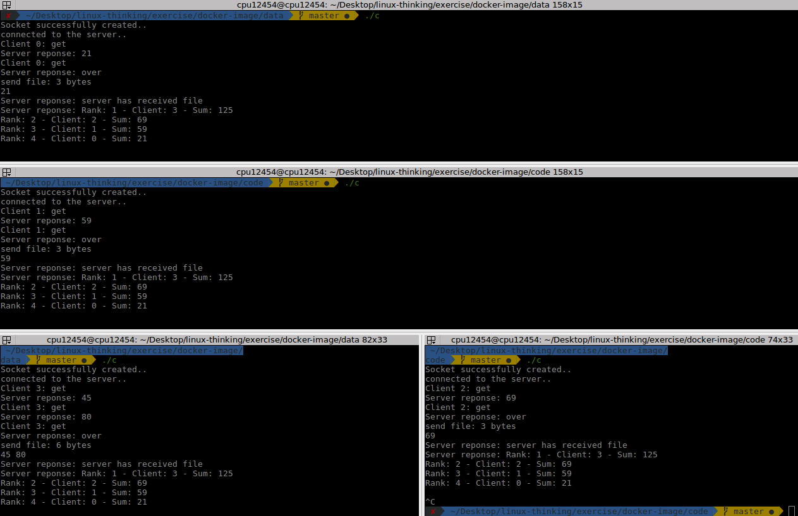

- [1. Tất tần cơ bản về Docker](#1-T%E1%BA%A5t-t%E1%BA%A7n-c%C6%A1-b%E1%BA%A3n-v%E1%BB%81-Docker)
- [2. Giới thiệu](#2-Gi%E1%BB%9Bi-thi%E1%BB%87u)
- [3. Container](#3-Container)
  - [3.1. Tiểu sử](#31-Ti%E1%BB%83u-s%E1%BB%AD)
  - [3.2. Đặc điểm](#32-%C4%90%E1%BA%B7c-%C4%91i%E1%BB%83m)
- [4. Cách hoạt động](#4-C%C3%A1ch-ho%E1%BA%A1t-%C4%91%E1%BB%99ng)
- [5. Các lệnh cơ bản](#5-C%C3%A1c-l%E1%BB%87nh-c%C6%A1-b%E1%BA%A3n)
- [6. Viết Dockerfile cơ bản](#6-Vi%E1%BA%BFt-Dockerfile-c%C6%A1-b%E1%BA%A3n)
- [7. Thực hành với Xếp bi](#7-Th%E1%BB%B1c-h%C3%A0nh-v%E1%BB%9Bi-X%E1%BA%BFp-bi)
- [8. Nguồn tham khảo](#8-Ngu%E1%BB%93n-tham-kh%E1%BA%A3o)


# 1. Tất tần cơ bản về Docker

<div align="center">
    
</div>


# 2. Giới thiệu 
-   Docker có rất nhiều định nghĩa:
    -   Docker là một dự án `mã nguồn mở` giúp tự động triển khai các ứng dụng Linux và Windows vào trong các `container` ảo hóa
    -   Nói cách khác, Docker là một `open platform` cung cấp cho người sử dụng các công cụ và server để có thể `đóng gói` và `chạy chương trình` của mình trên `môi trường khác nhau` nhanh nhất có thể
    -   Hiểu đơn giản, Docker là một phương thức để đóng gói và sắp xếp phần mềm

-   Docker cung cấp khả năng đóng gói hiệu quả, ta thiết lập các cấu hình môi trường ban đầu, khi ai đó muốn chạy app họ không cần phải biết về môi trường chạy app như java, ruby on rails,...

-   Thành phần cơ bản:
    -   `Docker engine`: tạo ra Docker image và Docker container
    -   `Docker Hub`: service lưu trữ các Docker image
-   Thuật ngữ:
    -   `Docker machine`: tạo ra các Docker engine trên máy chủ
    -   `Docker compose`: chạy app bằng cách define cấu hình các Docker thông qua tệp cấu hình
    -   `Docker image`: 
        -   Tập hợp các tệp của ứng dụng, được tạo ra bởi `Docker engine`, nội dung của image không bị thay đổi khi di chuyển. 
        -   Docker image dùng để chạy các Docker container
        -   Đây là một template chỉ cho phép đọc, 1 image có thể chứa hệ điều hành ubuntu và apps
    -   `Docker container`: 
        -   Một dạng run time của các `Docker image` dùng để làm môi trường chạy ứng dụng
        -   Có nét giống với directory giữ mọi thứ chúng ta cần để chạy 1 app
        -   Mỗi container được tạo từ Docker image. Docker container có thể có các trạng thái run, started, stopped, moved và deleted

# 3. Container

## 3.1. Tiểu sử 

-   Ngày xưa, mỗi máy chỉ chạy 1 OS có cấu tạo sau: `máy chủ vật lý` + `hệ điều hành (OS)` + `application`
  
    <div align="center">

    
    </div>

-   Sau đó, để có thể tận dụng phần cứng nhiều hơn, công nghệ ảo hóa `virtualization` ra đời như Virtual Box hay VMware. Công nghệ này có thể cài đặt nhiều OS nhưng lại bị hạn chế về tài nguyên và thời gian
    -   Tài nguyên: bật máy ảo lên không làm gì nhưng máy thật phải cung cấp tài nguyên do phải cung cấp cứng dung lượng ổ cứng và RAM
    -   Thời gian: khởi động khá lâu, lên tới hàng phút

    <div align="center">
    
    </div>

-   Để giải quyết vấn đề của `virtualization`, công nghệ `containerlization` ra đời

     <div align="center">
    
    </div>

    -   Trên 1 máy chủ vật lý, sinh ra nhiều máy con, máy con này dùng chung phần nhân của máy mẹ (Host OS) và chia sẻ nhau tài nguyên máy mẹ
    -   Khi nào tài nguyên cần thì cấp, sài bao nhiêu cấp bấy nhiêu

-   So sánh Docker và Virtual Machines:

| Docker 	| Virtual machines 	|
|------------------------------------------------------------------------------------------------------	|-----------------------------------------------------------------------------------------	|
| Docker có thời gian boot tính bằng giây 	| Mất vài phút để khởi động 	|
| Execution tận dụng execution engine, đại diện cho OS virtualization 	| Execution tận dụng Hypervisor, đại diện cho hardware-level virtualization 	|
| Hiệu quả bộ nhớ hơn vì không cần không gian cho việc ảo hóa 	| Ít hiệu quả memory vì toàn bộ OS được load trước khi start service 	|
| Không cung cấp việc độc lập với hệ thống nên có khả năng gặp vấn đề hơn 	| Cách ly hiệu quả với hệ điều hành gốc nên khả năng can thiệp OS là thấp 	|
| Deloy trên Docker cực kì dễ dàng chỉ cần 1 image, containerized, có thể được dùng ở các OS khác nhau 	| Deploy trên VMs là một quá trình khá lâu khi mà giống như các thực thể độc lập thực thi, phải chạy cả OS và chạy tool trên OS độc lập đó 	|
| Docker có cơ chế quản lý tương đối phức tạp vì bao gồm cả các công cụ quản lý docker và bên thứ 3 	| Các công cụ liên quan đến VM tương đối dễ sử dụng hơn và đơn giản hơn khi làm việc 	|
| Performance phụ thuộc vào OS chính, hiệu năng cao 	| Performance bị giới hạn ở một mức độ cho phép của OS chính và người dùng 	|

## 3.2. Đặc điểm

-   Các phần mềm sẽ được `Container Engine` đóng gói thành các `container`
-   `Container` là giải pháp chuyển giao phần mềm đáng tin cậy giữa các `môi trường` máy tính khác nhau bằng cách
    -   Tạo ra môi trường chứa mọi thứ mà phần mềm chạy được
    -   Không bị hệ thống làm ảnh hưởng
    -   Không ảnh hưởng hệ thống
-   Ví dụ: nếu bạn có một phần mềm Java, bạn không cần cài đặt JDK mà chỉ cần tìm container đã có setting tương ứng chạy nó lên, cho phần mềm đó chạy trong container đó, khi không sài thì tắt hay xóa nó đi, không ảnh hưởng tới máy thật
-   Ưu điểm:
    -   Linh động: triển khai được ở bất kì đâu
    -   Nhanh: gần như tức thì do chia sẻ Host OS
    -   Nhẹ: container sử dụng chung images không tốn nhiều disk
    -   Đồng nhất: không bị sự sai khác về mặt môi trường khi làm team
    -  Đóng gói: ẩn môi trường bao gồm cả app vào trong 1 gói được gọi là container
-   Nhược điểm:
    -   Nếu Host OS có lỗ hỏng ở kernel sẽ ảnh hưởng toàn bộ container có trong host đấy
    -   Người dùng hoặc ứng dụng nào đấy trong container chiếm được quyền root có thể lấy data hay điều khiển máy host cũng như container khác

# 4. Cách hoạt động
-   Docker image là nền tảng của container, là khung xương để định hình container, khi chạy image sẽ tạo ra container. Giống như class so với thực thể
-   Đối với Docker cần phải có image và container:
    -   Container: tương tự như máy ảo, xuất hiện khi chạy image
    -   Image: không phải file vật lý mà chứa trong Docker. Một image bao gồm hệ điều hành (Windows, Ubuntu, …) và các môi trường lập trình được cài sẵn (httpd, mysqld, nginx, python, git, …)
-   Bên cạnh đó, Docker Hub là store lưu trữ các file images hỗ trợ set up nhanh cho người dùng

-   Docker engine là ứng dụng client-server với các component chính:
    -   1 server là loại long-running program gọi là daemon process
    -   REST API mà chương trình dùng để nói chuyện với daemon
    -   Command line interface client
-   CLI sẽ dùng REST API để điều khiển hoặc tương tác với Daemon thông script hoặc CLI commands 
<div align="center">
    
</div>

-   Kiến trúc Docker

<div align="center">
    
</div>

-   Docker daemon lắng nghe Docker API request và quản lý Docker object

-   Docker registries lưu trữ các Docker images, Docker Hub là 1 loại reigistry public mà ai cũng có thể dùng 

-   Client gửi các commands tới docker daemon, docker daemon thực hiện chúng. Ví dụ nếu build thì client - docker daemon - images, nếu pull thì client - docker daemon - registry - images, nếu run thì client - docker daemon - images - containers

# 5. Các lệnh cơ bản 
-   Cài đặt Docker:

```bash
$ sudo apt-get update
$ sudo apt-get install docker.io
```

-   Kiểm tra Docker đã cài đặt thành công

```bash
$ docker -v
Docker version 18.09.2, build 6247962
```
-   Pull một image từ Docker Hub

```docker
docker pull {image_name}
```

-   Liệt kê các images hiện có

```docker
docker images
```

-   Xóa một image

```docker
docker rmi {image_id/name}
```

-   Liệt kê các container đang chạy

```docker
docker ps
docker ps -a #Liệt kê các container đã tắt
```

-   Xóa một container

```docker
docker rm -f {container_id/name}
```

-   Đổi tên một container

```docker
docker rename {old_container_name} {new_container_name}
```

-   Khởi động một container 

```docker
docker start {new_container_name}
docker exec -it {new_container_name} /bin/bash
```

-   Tạo mới một container, đồng thời khởi động với tùy chọn cổng và volume

```docker
docker run --name {container_name} -p {host_port}:{container_port} -v {/host_path}:{/container_path} -it {image_name} /bin/bash
```

-   Xem các thay đổi trên container

```docker
docker diff {container_name}
```

-   Commit các thay đổi trên container và image

```docker
docker commit -m "message" {container_name} {image_name}
```

-   Save image thành file .tar

```docker
docker save {image_name} > {/host_path/new_image.tar}
```

-   Tạo một image mới từ file .tar

```docker
cat musashi.tar | docker import - {new_image_name}:latest
```

-   Xem lịch sử các commit trên image

```docker
docker history {image_name}
```

-   Khôi phục lại images từ IMAGE_ID

```docker
docker tag {iamge_id} {image_new_name}:{tag}
```

-   Build một image từ container

```docker
docker build -t {container_name} .
```

-   Sự khác biệt giữa `docker exec`, `docker run` và `docker start`
    -   `docker exec`: vận hành container docker hiện có hay đã tồn tại
    -   `docker run`: thao tác đến các images đã tồn tại hoặc truy xuất từ localhost, mỗi lần chạy command sẽ tạo ra 1 container mới tương ứng
    -   `docker start`: bắt đầu lại container và khởi động container chạy đến lần xử lý dừng tiếp theo

# 6. Viết Dockerfile cơ bản

-   `Dockerfile` là một tập tin dạng text chứa một tập các câu lệnh để tạo mới một Image trong Docker
-   Một số lệnh trong Dockerfile:
    -   **FROM <base_image>:<phiên_bản>**: đây là câu lệnh bắt buộc phải có trong bất kỳ Dockerfile nào. Nó dùng để khai báo base Image mà chúng ta sẽ build mới Image của chúng ta
    -   **MAINTAINER <tên_tác_giả>**: câu lệnh này dùng để khai báo trên tác giả tạo ra Image, chúng ta có thể khai báo nó hoặc không
    -   **RUN <câu_lệnh>**: chúng ta sử dụng lệnh này để chạy một command cho việc cài đặt các công cụ cần thiết cho Image của chúng ta
    -   **CMD <câu_lệnh>**: trong một Dockerfile thì chúng ta chỉ có duy nhất một câu lệnh CMD, câu lệnh này dùng để xác định quyền thực thi của các câu lệnh khi chúng ta tạo mới Image
    -   **ADD \<src> \<dest>**: câu lệnh này dùng để copy một tập tin local hoặc remote nào đó (khai báo bằng \<src>) vào một vị trí nào đó trên Container (khai báo bằng \<dest>)
    -   **ENV <tên_biến>**: định nghĩa biến môi trường trong Container
    -   **ENTRYPOINT <câu_lệnh>**: định nghĩa những command mặc định, cái mà sẽ được chạy khi container running
    -   **VOLUME <tên_thư_mục>**: dùng để truy cập hoặc liên kết một thư mục nào đó trong Container
  
-   Ta bắt đầu tạo thư mục và file Docker:

```bash
$ mkdir docker-image
$ cd docker-image
$ touch Dockerfile
$ touch script.sh
```

-   Trong Dockerfile

```docker
FROM alpine

MAINTAINER conglt
 
COPY script.sh /script.sh

CMD ["/script.sh"]
```

-   Trong file script.sh:

```bash
#! bin/sh

echo hello world, from a script file!
```

-   Sau đó chạy lệnh:

```bash
$ docker build .

Sending build context to Docker daemon  3.072kB
Step 1/4 : FROM alpine
 ---> 055936d39205
Step 2/4 : MAINTAINER conglt
 ---> Using cache
 ---> d25d4207ec75
Step 3/4 : ADD script.sh /script.sh
 ---> c9f7ed873055
Step 4/4 : CMD ["./script.sh"]
 ---> Running in acd8f3eacb82
Removing intermediate container acd8f3eacb82
 ---> 4c67c946d5e5
Successfully built 4c67c946d5e5
```

-   Sau khi build thành công, chạy run image:

```bash
$ docker run --name test 4c67c946d5e5
hello world, from a script file!
```


# 7. Thực hành với Xếp bi
-   Tips: chạy Docker với quyền non-root
    -   Tạo docker group

        ```docker
        $ sudo groupadd docker
        ```
    -   Add user vào docker group

        ```docker
        $ sudo usermod -aG docker $USER
        ```
    -   Log out và sau đó log in lại ta sẽ chạy được với non-root user

-   Ta có thể thực hiện 2 cách 
    -   Cách 1: chỉ cần deploy file out đã compile từ gcc

        ```docker
        FROM gcc:7.4.0 
        MAINTAINER conglt
        RUN mkdir /home/code
        WORKDIR /home/code
        COPY ./code .
        ENTRYPOINT ["./server.o"]
        ```

    -   Cách 2: thực hiện makefile để compile mỗi lần chạy docker

        [Makefile](exercise/docker-image/code/Makefile)

        [File script run server](exercise/docker-image/code/runServerXepBi.sh)

        ```docker
        FROM gcc:7.4.0
        MAINTAINER conglt
        RUN mkdir /home/code
        WORKDIR /home/code
        COPY ./code .
        RUN apt-get update
        CMD chmod +x ./*
        ENTRYPOINT ["./runServerXepBi.sh"]
        ```

-   Build file images
  


-   Chạy server trên Docker
  


-   Test client kết nối từ máy thật vào máy ảo Docker
  



# 8. Nguồn tham khảo

https://docs.docker.com/engine/docker-overview/

https://docs.docker.com/install/

https://viblo.asia/p/docker-nhung-kien-thuc-co-ban-phan-1-bJzKmM1kK9N

https://viblo.asia/p/docker-chua-biet-gi-den-biet-dung-phan-1-lich-su-ByEZkWrEZQ0

https://kipalog.com/posts/Cac-lenh-co-ban-voi-docker